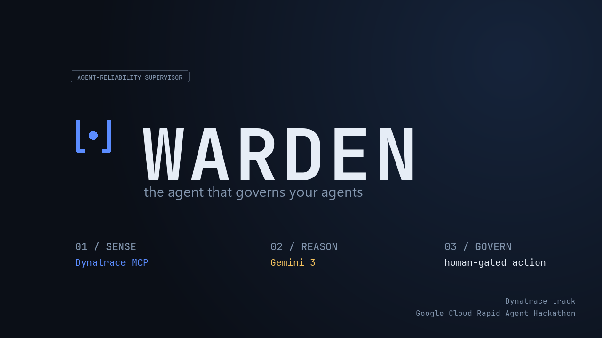
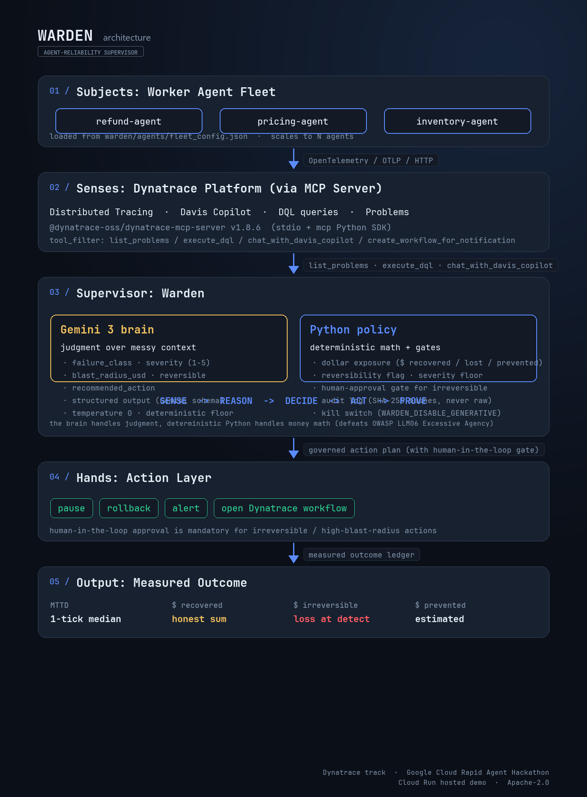

# Warden: the agent that governs your agents



**Live demo (Cloud Run, sim mode, no login required):**
**https://warden-qfobjfyspq-uc.a.run.app**

The hosted dashboard has two tabs: **Operator console** (live reasoning, fleet
state, scenario injectors, human-gated approvals, incident audit trails) and
**Live Evidence** (screenshots of real OpenTelemetry traces and per-agent metrics
landing in a Dynatrace tenant, with the DQL queries and span attributes
documented inline).

Warden is an autonomous agent-reliability supervisor built on **Gemini 3** (via
the `gemini-flash-latest` alias on **Vertex AI**, deployed through **Google
Cloud Agent Builder ADK**) and the **Dynatrace MCP server** (real tenant:
`xwy37883.apps.dynatrace.com`). It watches a fleet of production AI agents,
and when one goes rogue, Warden catches it, diagnoses it, and contains it
under human oversight before it does more damage.

The hackathon brief named three real-world challenge themes: World Cup
logistics, financial services, and brick-and-mortar retail. The demo headlines
**financial services** with a rogue refund agent, but the same loop
generalizes to any fleet: register a new worker type via `fleet_config.json`
and Warden supervises World Cup vendor agents, retail inventory agents, or
loan-workflow agents with no supervisor-side change.

## How Warden meets the hackathon's "Build Your Agent" criteria

| Requirement | How Warden satisfies it | File |
|---|---|---|
| Built with **Gemini 3** | `gemini-flash-latest` on **Vertex AI** resolves to a Gemini 3 family model (`gemini-3-flash-preview` per the Gemini API changelog Jan 21 / Mar 6 2026 entries). Verified at runtime against the live tenant. | `warden/config.py`, `warden/supervisor/gemini_brain.py` |
| Using **Google Cloud Agent Builder** | Canonical ADK `LlmAgent` + `McpToolset` wiring as the production deploy target for Agent Runtime / Agent Engine. The supervisor loop calls Gemini through the `google-genai` SDK on the same Vertex AI surface, with `tool_filter` enforcing least privilege on the five Dynatrace MCP tools Warden actually invokes (`list_problems`, `execute_dql`, `generate_dql_from_natural_language`, `chat_with_davis_copilot`, `create_workflow_for_notification`). `scripts/adk_smoke.py` asserts the filter matches what the runtime supervisor calls. | `warden/adk_agent.py`, `scripts/adk_smoke.py`, `docs/DEPLOY.md` |
| Integrate the partner's **MCP server** | Dynatrace MCP server (`@dynatrace-oss/dynatrace-mcp-server`) is Warden's only sense organ. 20 tools enumerated live, `list_problems`, `execute_dql`, and `chat_with_davis_copilot` all verified end-to-end against the tenant. | `warden/dynatrace/mcp_client.py` |
| Move beyond chat (use tools, take action) | Pause, rollback, alert, and Dynatrace workflow creation are real actions executed behind a human-approval gate, not just answers. | `warden/supervisor/interventions.py`, `warden/supervisor/policies.py` |
| Multi-step mission with human in control | Sense -> reason -> decide -> act -> prove, with a real blocking gate for irreversible / high-blast-radius actions. | `warden/supervisor/loop.py` |

Submission for the Google Cloud Rapid Agent Hackathon (Dynatrace track).

## The problem

This hackathon is about agents that take real actions in production. That raises a
question almost no one is answering: once you have a fleet of autonomous agents
acting on real systems (approving refunds, changing prices, moving inventory), who
watches them?

Today the answer is "a human, eventually, after the damage shows up on a
dashboard." That does not scale to a fleet of agents running 24/7. Warden is the
missing supervisory layer. It treats every worker agent as an untrusted actor,
grounds its judgment in live production telemetry from Dynatrace, and acts the
moment an agent's behavior goes out of policy.

## The loop

```
        Worker agent fleet:  RefundAgent   PricingAgent   InventoryAgent ...
              |  each emits OpenTelemetry (traces, metrics, logs, actions)
              v
        Dynatrace  <----  list_problems / execute_dql / chat_with_davis_copilot
              ^ (MCP server)                                            |
              |                                                         |
        WARDEN  (Gemini reasoning via google-genai SDK)                 |
          1. SENSE    pull problems + telemetry from Dynatrace via MCP  |
          2. REASON   classify: which agent, what failure, blast radius |
          3. DECIDE   apply policy: act autonomously, or ask a human  --+
          4. ACT      pause / roll back / alert / open a workflow
          5. PROVE    measured incident report: MTTD, $ recovered, $ lost
```

Warden is agentic, not a dashboard. It plans, calls tools, and takes action, while
keeping a human in control for anything irreversible.

## Design choice that matters: deterministic vs. generative

Gemini supplies judgment (failure class, severity, recommended action, plain
language summary). The dollar figures and reversibility are computed
deterministically in Python from the telemetry. The model never invents money
math. This keeps the impact numbers honest and prevents prompt injection inside an
agent's telemetry from inflating a blast radius.

## Why this fits the Dynatrace track

1. The partner MCP is load-bearing, not bolted on. Remove Dynatrace and Warden is
   blind, because telemetry is its only sense organ.
2. It extends Dynatrace's own direction. Dynatrace already monitors AI agents;
   Warden adds the next step, which is governing and remediating them.
3. It proves impact instead of claiming it. Every run produces hard numbers (time
   to detect, dollars recovered, dollars lost), not adjectives.

## Run it in simulation mode (no cloud, no credentials)

The simulation engine is pure Python standard library, so it runs on Python 3.11
through 3.14 with nothing to install.

```bash
python -m warden.web.app        # live dashboard at http://127.0.0.1:8080
python -m scripts.demo          # CLI: watch Warden catch a rogue agent
python -m scripts.demo --inject price_collapse        # reversible: shows $ recovered
python -m scripts.demo --inject refund_fraud_loop --deny-approval   # deny the human gate
python -m scripts.bench         # quantified detection rate + false-positive rate
python -m unittest discover -s tests -v               # tests
```

### Measured performance (`python -m scripts.bench --episodes 30`)

| Metric | Result |
|---|---|
| False-positive rate (30 healthy episodes, no injection) | **0.00%** |
| Detection rate, refund fraud | **100%** |
| Detection rate, price collapse | **100%** |
| Detection rate, inventory over-order | **100%** |
| Cross-fleet noise (innocent agents flagged) | 0 |
| Median time-to-detect | **1 tick** (p95: 1 to 3) |
| Median $ recovered, reversible scenarios | $336 to $409 |
| Median $ lost at detect, irreversible refund fraud | $2,156 |

In the dashboard: click an "Inject a rogue scenario" button, watch the live
reasoning feed, and click Approve or Deny when the human-in-the-loop bar appears.

The mock Dynatrace mirrors the real MCP tool surface (`list_problems`,
`execute_dql`, `chat_with_davis_copilot`, and the rest), so the exact same Warden
logic runs locally and against a real tenant.

## Run it in live mode (real Gemini + real Dynatrace MCP)

Google ADK targets Python 3.10 to 3.13, so use a 3.12 or 3.13 virtual env for the
ADK deploy path.

```bash
python -m venv .venv && .venv\Scripts\activate     # Windows
pip install -r requirements.txt
copy .env.example .env                             # set GCP + Dynatrace values
set WARDEN_MODE=live
python -m scripts.live_check                       # MCP handshake + Gemini diagnosis
python -m scripts.otel_smoke                       # ship OTel spans + metrics to Dynatrace
python -m scripts.demo                             # full loop against real Dynatrace
```

For `scripts.otel_smoke` to work, the Dynatrace token needs OTLP-ingest scopes
(`openTelemetryTrace.ingest`, `metrics.ingest`, `logs.ingest`). See `.env.example`
for the auth options (`DT_API_TOKEN` classic, `DT_OTEL_BEARER` platform).

See [docs/DEPLOY.md](docs/DEPLOY.md) for the canonical ADK + MCP toolset pattern and
Cloud Run / Agent Runtime deployment.

## Architecture



| Layer | Component | Tech |
|---|---|---|
| Brain | `warden/supervisor` | Gemini 3 on Vertex AI via the `google-genai` SDK (Flash on the loop), with a defensive scripted fallback for offline dev and for any transient model error |
| Senses | `warden/dynatrace` | Dynatrace MCP server (mock mirror for offline dev) |
| Hands | `warden/supervisor/interventions.py` | pause / rollback / alert behind a human-approval gate |
| Subjects | `warden/agents` | config-driven worker-agent fleet, OpenTelemetry-instrumented |
| Stress | `warden/chaos` | injects realistic rogue-agent scenarios |
| Surface | `warden/web` | stdlib HTTP server, server-sent-events live console |
| Deploy | docs/DEPLOY.md | Agent Runtime or Cloud Run, with Secret Manager |

## Scaling to N agents

Warden's fleet is N-agent by construction. Adding a new worker is two steps,
neither of which touches the supervisor:

```python
# 1. write the worker, register the type
from warden.agents import WorkerAgent, register_worker

@register_worker
class PaymentsAgent(WorkerAgent):
    domain = "payments"
    def _tick_normal(self): self._emit("heartbeat")
    def _tick_rogue(self):  self._emit("action", action_type="settle",
                                       value_usd=900, reversible=False)
```

```json
// 2. add a row to warden/agents/fleet_config.json
{"fleet": [
  {"id": "refund-agent",    "type": "RefundAgent"},
  {"id": "pricing-agent",   "type": "PricingAgent"},
  {"id": "inventory-agent", "type": "InventoryAgent"},
  {"id": "payments-agent",  "type": "PaymentsAgent"}
]}
```

That is it. The supervisor loop iterates `fleet.agents.values()`. The Dynatrace
MCP sense organ does not care which `agent.id` reported the problem. The Gemini
brain takes the diagnosis as input. The policy gate, the intervention layer,
the OTel exporter, and the operator console all key off `agent.id`. The
three-agent demo is a chaos-injection seed, not an architectural ceiling.

In a real deployment, `fleet_config.json` is swapped for the customer's service
registry, a Secret Manager URL, or a control-plane API that calls
`fleet.add(WorkerProxy(agent_id))` for every onboarded ADK / LangChain /
third-party agent. Unknown worker types in the config are skipped with a
logged warning rather than crashing, so a typo in production cannot take the
supervisor down. Covered by `tests/test_fleet_config.py`.

## Status

Every layer of the live stack is verified end-to-end against a real Dynatrace
tenant. Both data planes are real:

- **Live Dynatrace MCP**: 20 tools enumerated, `list_problems`, `execute_dql`,
  `chat_with_davis_copilot` all return live data (`scripts/live_check.py`).
- **Live Gemini diagnosis**: structured `Diagnosis` returned in 2 seconds on a
  synthetic Dynatrace problem (failure_class, severity, recommended_action,
  blast_radius_usd, confidence).
- **Live OpenTelemetry push to Dynatrace**: 400+ `agent.action` and
  `agent.error` spans per `otel_smoke.py` run visible in Distributed Tracing
  under `service.name = warden`, plus `warden.agent.actions`,
  `warden.agent.errors`, `warden.agent.latency_ms`, `warden.agent.cost_usd`,
  `warden.agent.value_usd` metrics broken down by `agent.id`
  (`scripts/otel_smoke.py`).
- **Benchmark**: 100% detection across 3 scenarios, 0% false-positive on 30
  healthy episodes, 1-tick median MTTD.

The hosted dashboard runs in sim mode for judging-week stability (deterministic
loop, instant replay). The same code path runs in live mode against the real
Dynatrace tenant; the **Live Evidence** tab on the hosted URL surfaces three
captures from that tenant. Live-mode reproduction is one command:
`python -m scripts.live_check` (MCP handshake + Gemini diagnosis) plus
`python -m scripts.otel_smoke` (OTLP into Distributed Tracing).

## License

[Apache 2.0](LICENSE).
